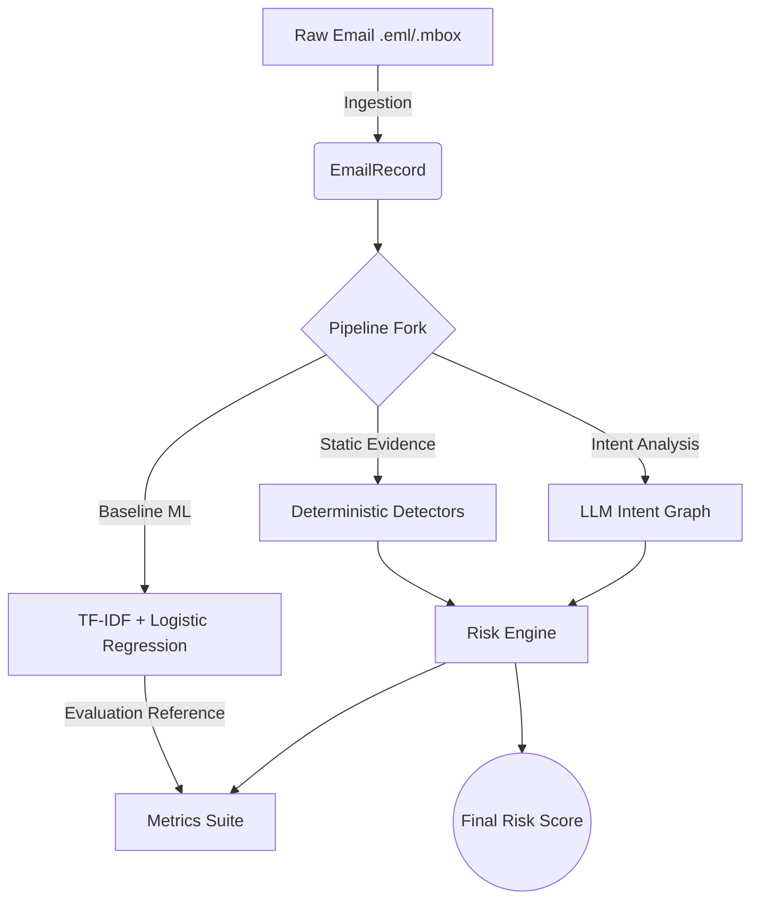

# DeceptionGuard - Advanced Email Security Analysis Framework


## Abstract
DeceptionGuard is a local-first Python tool designed for rigorous, scientific analysis of emails to detect phishing attempts. By combining a fast TF-IDF baseline machine learning model, deterministic deterministic heuristic evidence extraction, and an LLM-based intent analysis graph, DeceptionGuard offers a comprehensive defensive pipeline. Built without hard third-party dependencies in its core execution path, it operates completely offline (utilizing LLM APIs optionally, with reliable local fallback heuristics) and provides robust CLI tools and a modern Web UI for evaluation, batch processing, and dataset testing.

This document serves as both the technical manual and the architectural whitepaper for the system.

---

## 1. System Architecture

DeceptionGuard operates through a linear, composable pipeline representing the lifecycle of an email analysis:



### Components Detailed:
| Component | Functionality | Underlying Technology |
|-----------|---------------|-----------------------|
| **Ingestion** | Parses multipart MIME architectures, handles advanced encoding schemes (Base64, Quoted-Printable), normalizes Bidi/zero-width controls, and tracks nested CSS hidden text visibility vectors. | Python stdlib `email` and `html.parser` |
| **Baseline Classifier** | Serves as the quantitative benchmark for pipeline improvement. | `scikit-learn` TF-IDF + Logistic Regression |
| **Evidence Detectors** | Extensible, regex and rule-based detectors emitting specific `Evidence` objects (e.g., `BRAND_TYPOSQUATTING`, `URL_IP_LITERAL`). | Pure Python heuristics |
| **Intent Graph** | Extracts a structured schema (Urgency, Financial, Actions, Tone) via LLM (e.g., GPT-4 / open-weights) or local heuristic fallbacks if unauthenticated. | `litellm` / `urllib` standard APIs |
| **Risk Engine** | Computes a final deterministic risk score via bounded, dynamically-configurable additive weights (capped at 100). | TOML-based configurations |
| **UI & CLI** | Exposes operations (`scan`, `evaluate`, `serve`) to batch analyze or explore graphs. | `argparse`, HTML5/JS |

---

## 2. Methodology & Datasets

To ensure rigorous analysis, DeceptionGuard leverages cross-domain public corpora and sophisticated splitting methodologies.

### Supported Corpora
- **SpamAssassin Public Corpus**: Standard ham communications baseline.
- **Jose Nazario Phishing Corpus**: Historical static evidence phishing patterns (2005-2015).
- **Enron Email Dataset**: Representing real corporate communications (PII-scrubbed).
- **DeceptionGuard Synthetic Phishing**: Modern LLM-generated spear-phishing lures.

### Preprocessing and Validation
1. **Deduplication**: We leverage k-shingle hashing (k=5) paired with MinHash signatures. Any emails sharing a Jaccard similarity >= 0.9 are dropped to prevent train/test data leakage.
2. **Robust Splitting**: Support for Stratified Random Splits, Cross-corpus generalization tests, and strict Temporal Splitting.

---

## 3. Evaluation Protocol

DeceptionGuard's E2E evaluation (`dg evaluate --suite full`) is designed to measure absolute pipeline efficacy across distinct architectural layers (Ablation Studies).

### Measured Ablations
1. **Baseline**: Pure ML model predictions.
2. **Evidence Only**: Deterministic heuristic rules.
3. **Graph Only**: LLM extracted structural intents.
4. **Full Pipeline**: The fused Evidence + Intent Graph engine.

### Core Metrics Captured
- **Classification Stats**: Precision, Recall, F1-Score.
- **Distribution Stats**: ROC-AUC, PR-AUC, FPR at 95% TPR.
- **Calibration**: Expected Calibration Error (ECE) via 10-bin binning.
- **Confidence Intervals**: 95% CIs produced via 1000-iteration Bootstrapping.
- **Significance Testing**: McNemar tests comparing the full pipeline against the Baseline.

---

## 4. Adversarial Robustness & QA

DeceptionGuard was hardened against adversarial AI-evasion attempts and underwent significant QA testing. 

### Robustness Features
The test suite inherently mutates payloads (`--suite adversarial`) using:
- **Homoglyphs**: Cyrillic/Greek lookalike characters mapped dynamically.
- **Zero-Width Injections**: Invisible character interleaving to break NLP tokenization.
- **Typosquatting & Permutation**: Brand domain mutations (e.g., `paypaI.com`).

### Quality Assurance (v1.0.0 Release)
The system was aggressively tested resulting in comprehensive coverage (>80% execution paths) and resolution of critical structural faults (DEF-001 through DEF-005):
- **Mock Isolation**: Hardened test I/O mocking (avoiding `Path.parent` overrides causing WinError 6).
- **Offline CLI Execution**: Prevented API execution blocks and slow bootstrapping loops during `pytest` evaluation routines.
- **Configuration Validation**: Resolved overlap validation logic failures when loading risk engine configuration bounds.
- **HTML Parser Bleed**: Replaced boolean nested tracking with robust state stacks, preventing hidden-style (e.g. `display: none`) attribute bleeding onto visible text.
- **Array Consistency**: Hardened the Scikit-Learn dimension constraints for balanced StratifiedSplits.

---

## 5. Setup & Usage

### Installation

```bash
# Clone the repository
git clone https://github.com/Swayam-Swaroop-Sahu/DeceptionGuard
cd DeceptionGuard

# Create isolated environment
python -m venv venv
# Windows: venv\Scriptsctivate
# Linux/Mac: source venv/bin/activate

# Install package (Use [dev] for baseline and testing extensions)
pip install -e ".[dev]"
```

### Configuration (Optional)
To leverage the LLM for intent extraction, copy `.env.example` to `.env`:
```env
DG_LLM_API_KEY=your_key_here
DG_LLM_BASE_URL=https://api.openai.com/v1
DG_LLM_MODEL=gpt-4
```
*(Without API keys, DeceptionGuard automatically utilizes a built-in heuristic intent extractor.)*

---

## 6. CLI Operations

```bash
# Scan a single EML file
dg scan tests/fixtures/phishing_email.eml

# Scan a full MBOX file
dg scan tests/fixtures/mixed_mbox.mbox

# Run pipeline evaluations against a generated dataset
dg evaluate --dataset src/deceptionguard/data/processed/placeholder_test.csv

# Launch the interactive HTML UI
dg serve
```

### Risk Engine Weights (`weights.toml`)
Dynamically control scoring attributes:
```toml
[factor_weights]
claimed_identity_mismatch = 25
urgency_high = 30
authority_spoof = 20
payload_links = 15
action_request = 10
```

---

## 7. Testing Strategy

The project utilizes a strict standard-library testing pyramid (ensuring zero unexpected third-party failures).
```bash
# Run entire test suite via Pytest
python -m pytest tests/ -v

# Generate Branch Coverage Report
python -m coverage run --branch --source=src -m pytest tests/
python -m coverage report -m
```

---

## 8. License & Extending
DeceptionGuard is available under the **MIT License**.

To add custom risk factors, define new functions in `src/deceptionguard/evidence/detectors.py` and register their resulting penalty configurations in `src/deceptionguard/risk_engine/weights.toml`.
